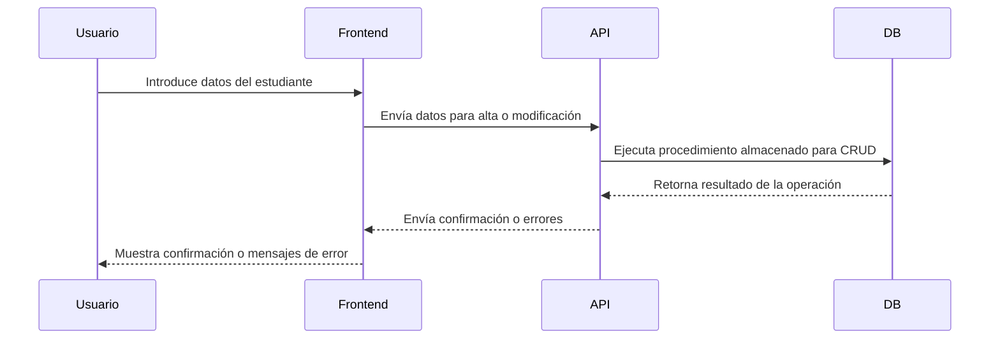

# Proyecto de Gestión de Estudiantes

Este proyecto es una aplicación de gestión de estudiantes que integra un frontend moderno con una API robusta y una base de datos eficiente, desplegado en Azure. La aplicación está diseñada para proporcionar una experiencia fluida en la administración de datos estudiantiles, desde la alta y consulta hasta la modificación y eliminación de registros.

## Descripción General

La aplicación permite gestionar estudiantes con un enfoque en la validación de datos y la retroalimentación efectiva. Utiliza un sistema robusto de validaciones que garantiza la integridad de los datos a través de múltiples capas:

- **Frontend**: Implementado con React y Material-UI, con Redux para la gestión del estado global y React Router para la navegación. El frontend incluye validaciones a nivel de interfaz para asegurar la calidad de los datos ingresados.
  
- **API de .NET**: Desarrollada con .NET 8 a partir de la plantilla .NET Core Web API, gestiona la lógica de negocio y las operaciones CRUD sobre los datos de los estudiantes. La API se encarga de procesar las solicitudes y aplicar validaciones adicionales antes de interactuar con la base de datos.

- **Base de Datos SQL Server**: Utiliza T-SQL para la administración de datos. Se han implementado procedimientos almacenados y transacciones para manejar operaciones CRUD, con un sistema de validación a nivel de base de datos para asegurar la consistencia y exactitud de los datos.

## Componentes Principales

### Frontend
- **Tecnologías**: React, Redux, React Router, Material-UI.
- **Funcionalidad**:
  - Interfaz de usuario para gestionar estudiantes.
  - Validaciones de entrada para garantizar datos correctos y completos.
  - Feedback al usuario para errores de entrada, basados en respuestas de la API.

### API de .NET
- **Tecnologías**: .NET 8.
- **Funcionalidad**:
  - Gestión de operaciones CRUD sobre estudiantes.
  - Validación y procesamiento de datos antes de interactuar con la base de datos.
  - Retroalimentación de errores a través de mensajes de alerta que se muestran en el frontend.

### Base de Datos SQL Server
- **Tecnologías**: T-SQL.
- **Funcionalidad**:
  - Procedimientos almacenados para operaciones CRUD.
  - Validaciones a nivel de base de datos para evitar duplicados, datos en formato incorrecto y asegurar la integridad de los registros.

## Arquitectura del Proyecto

- **Despliegue**:
  - La aplicación está desplegada en Azure, utilizando Azure App Services para las APIs y Azure SQL Database para la base de datos. El frontend está alojado en una Static Web App de Azure.

- **Estructura del Proyecto**:
  - **Repositorio 1**: Frontend
  - **Repositorio 2**: API de .NET
  - **Repositorio 3**: Scripts de Base de Datos SQL Server

## Detalles Técnicos por Repositorio

1. **Frontend**
   - **URL del Repositorio**: [Enlace al repositorio de Frontend](https://github.com/MarcoAlayn/students-crud-client)
   - **Descripción**: Implementa la interfaz de usuario para gestionar estudiantes, con validaciones y retroalimentación.
   - **Tecnologías Clave**:
     - React: Manejo de la interfaz y componentes.
     - Redux: Gestión del estado de la aplicación.
     - React Router: Navegación entre vistas.
     - Material-UI: Estilización de la interfaz.

2. **API de .NET**
   - **URL del Repositorio**: [Enlace al repositorio de .NET API](https://github.com/MarcoAlayn/CrudStudentsApi)
   - **Descripción**: Proporciona la lógica de negocio y gestiona las operaciones CRUD, con validaciones y retroalimentación.

3. **Base de Datos SQL Server**
   - **URL del Repositorio**: [Enlace al repositorio de Scripts de Base de Datos](https://github.com/MarcoAlayn/StudentsCrudDB)
   - **Descripción**: Contiene scripts para crear y gestionar la base de datos, incluyendo procedimientos almacenados para operaciones CRUD y validaciones.

## Diagrama de Secuencia

